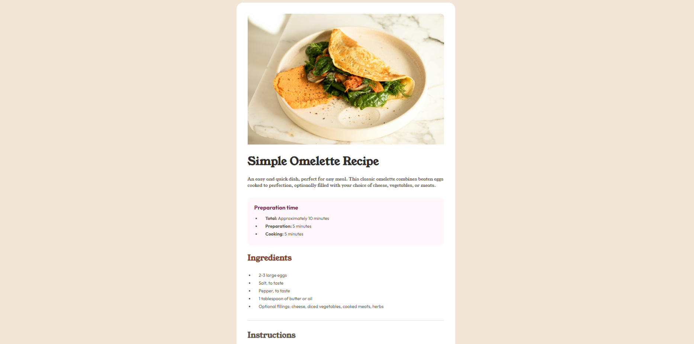

# Simple Omelette Recipe

This is a solution to the [Recipe page challenge on Frontend Mentor](https://www.frontendmentor.io/challenges/recipe-page-KiTsR8QQKm). Frontend Mentor challenges help you improve your coding skills by building realistic projects.

## Table of Contents

- [Overview](#overview)
  - [The Challenge](#the-challenge)
  - [Screenshot](#screenshot)
  - [Links](#links)
- [My Process](#my-process)
  - [Built With](#built-with)
  - [What I Learned](#what-i-learned)
  - [Continued Development](#continued-development)
- [Author](#author)

## Overview

### The Challenge

Users should be able to:

- View the optimal layout for the page depending on their device's screen size
- See hover states for all interactive elements on the page

### Screenshot

<!-- Add a screenshot of your solution here -->


### Links

- Solution URL: [Add your GitHub Repo URL here]
- Live Site URL: [Add your Live Site URL here]

## My Process

### Built With

- Semantic HTML5 markup
- CSS Custom Properties (Variables)
- CSS Flexbox
- Mobile-first workflow
- Fluid Typography (`clamp()`) and Fluid Layouts (`min()`)

### What I Learned

**1. Aligning Custom List Numbers**
My biggest challenge was the **Instructions section**. I struggled to set up the custom numbers (1, 2, 3...) so they had the correct spacing and color, but more importantly, aligning the text correctly next to them.

Initially, the text would wrap *under* the number, which looked messy. I learned that wrapping the text in a `div` and using Flexbox on the `<li>` allowed me to place the number and the text block side-by-side perfectly.

```css
/* How I solved the alignment issue */
.card-main-instructions ul li {
  display: flex;  /* Puts number and text side-by-side */
  gap: 1rem;      /* Creates space between them */
}

.number {
  color: var(--color-brown-800);
  font-weight: bold;
  flex-shrink: 0; /* Prevents the number from getting squashed */
}
````

**2. The Power of HTML Tables**
For the **Nutrition section**, I initially tried using lists with flexbox or spans, but nothing looked right. I had an "Aha\!" moment when I realized the design was literally a table of data.

I learned that the HTML `<table>` element is still incredibly relevant and powerful for semantic data. Styling it was a new challenge, particularly removing the borders, but `border-collapse` made it much cleaner.

```css
.nutrition-table {
  border-collapse: collapse; /* Removes gaps between borders */
  width: 100%;
}

.nutrition-table tr {
  border-bottom: 1px solid var(--color-stone-150); /* Adds the divider lines */
}
```

### Continued Development

In future projects, I want to deepen my understanding of:

1.  **Flexbox Nuances:** specifically `flex-shrink` and how it controls element sizing within a flex container.
2.  **CSS Tables:** deeply understanding properties like `border-collapse` and styling table cells efficiently.
3.  **Fluid Typography Strategies:** better decision-making on when to use `clamp()` (for headlines) versus standard `rem` (for body text) to ensure readability on small devices.
4.  **Layout Logic:** refining my instinct on when to use `media queries` (for layout shifts or padding changes) versus `min()` functions (for fluid widths).

## Author

  - Frontend Mentor - [@ahmad7000mahadi](https://www.frontendmentor.io/profile/ahmad7000mahadi)

